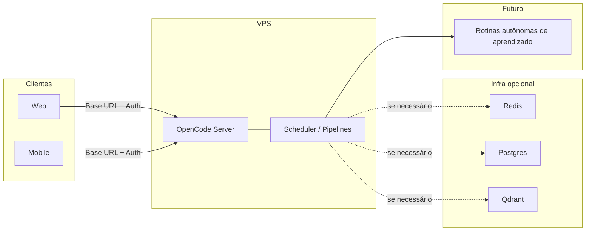

# Visão: OpenCode Server na VPS e integração Web/Mobile

Arquitetura de referência para rodar o OpenCode Server em uma VPS e integrar clientes Web e Mobile, com evolução futura para rotinas autônomas de aprendizado.

## Diagrama

- **VPS:** uma instância de `opencode serve --daemon` (OpenCode Server) com scheduler e pipelines; opcionalmente Redis, Postgres ou Qdrant na mesma rede (ex.: via docker-compose) se pipelines ou integrações precisarem.
- **Clientes:** aplicações Web e Mobile usam a mesma base URL do serve e a mesma autenticação (ex.: Basic Auth com `OPENCODE_SERVER_PASSWORD`), consumindo `/server` (status, pipelines, jobs, goals, proposals) e demais endpoints.
- **Futuro – Rotinas autônomas:** evoluem a partir dos pipelines e goals já documentados. O pipeline de **memória** (memory_extract, memory_consolidation, memory_rag_index) e a visão observe → decide → act → learn estão documentados no próprio OpenCode em [planning/autonomous-operation-revenue.md](../planning/autonomous-operation-revenue.md) e [architecture/memory-pipeline.md](memory-pipeline.md).

## Resumo

- **Web/Mobile** são clientes da API OpenCode; não há componente extra além do serve já documentado em [api/opencode-server.md](../api/opencode-server.md).
- **Rotinas autônomas de aprendizado** utilizam o scheduler e os pipelines do OpenCode Server, incluindo o pipeline de memória (extração, consolidação, RAG). O roadmap de fases está em [planning/roadmap-vps-opencode-server.md](../planning/roadmap-vps-opencode-server.md); a visão de operação autônoma e geração de renda está em [planning/autonomous-operation-revenue.md](../planning/autonomous-operation-revenue.md).

## Referências

- [api/opencode-server.md](../api/opencode-server.md)
- [planning/roadmap-vps-opencode-server.md](../planning/roadmap-vps-opencode-server.md)
- [runbooks/runbook-deploy-opencode-server-vps.md](../runbooks/runbook-deploy-opencode-server-vps.md)
- [memory-pipeline.md](memory-pipeline.md) — pipeline de memória (extract, consolidation, RAG)
- [planning/autonomous-operation-revenue.md](../planning/autonomous-operation-revenue.md) — visão operação autônoma e renda
