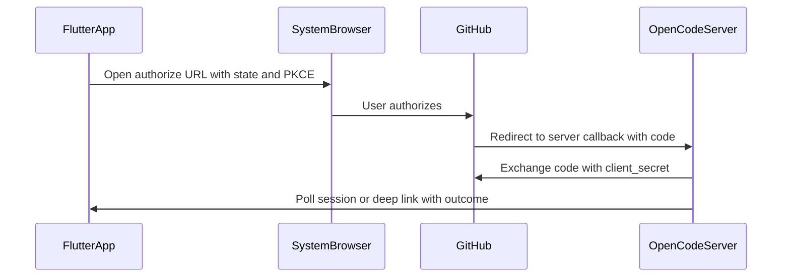

# Estratégia de integração GitHub (OAuth)

**Objetivo:** documentar o que o mercado usa para “ligar o GitHub” a produtos com utilizadores finais, o estado actual do OpenCode (device flow + PAT), e um desenho recomendado para **implementação futura** (fluxo por redirect / código de autorização). **Não descreve código implementado** para esse fluxo futuro — apenas especificação e decisão.

**Estado:** especificação / planeamento. Implementação posterior.

## Referências cruzadas

- API actual (device flow no servidor): [api/github-oauth-proxy.md](../api/github-oauth-proxy.md)
- Variáveis de ambiente: [env-vars.md](env-vars.md) (secção GitHub OAuth)
- App Flutter (contexto): [flutter-app.md](flutter-app.md)

---

## Padrões de mercado

| Cenário | Padrão dominante | Notas |
|--------|------------------|--------|
| Web (SaaS, dashboards) | OAuth 2.0 **Authorization Code**, com **PKCE** | Redirect para `github.com`, utilizador autoriza, callback com `code`; troca do `code` por token no **backend** (com `client_secret`). |
| Mobile (iOS/Android) | Mesmo modelo: browser de sistema + **deep link / App Link** + PKCE | O segredo não fica na app; redirect para URL que a app trata. |
| CLI, sem browser fiável, TVs | **Device Authorization Grant** (RFC 8628) — device flow | Utilizador abre browser à parte e introduz `user_code`. |
| Power users / CI | **Personal Access Token (PAT)** manual | Simples para quem gera token em GitHub Settings; pior UX para público geral. |

**Conclusão:** para apps com browser (incluindo Flutter), o padrão esperado por utilizadores é **redirect + código de autorização**, não device flow. O device flow é o padrão **correcto** para headless/CLI.

---

## Estado actual no OpenCode

| Mecanismo | Onde | Finalidade |
|-----------|------|------------|
| **Device flow** (proxy) | Servidor: `POST /github/auth/start`, `POST /github/auth/poll`; Flutter: diálogo “Add project” | Token sem expor `client_secret` ao cliente; funciona quando não há callback estável para o dispositivo. |
| **PAT** | Mesmo diálogo — campo de texto | Alternativa manual; comum em ferramentas para developers. |

Limitação típica: OAuth Apps na GitHub exigem **Authorization callback URL** registada. Se estiver apenas `http://localhost`, isso alinha com desktop/loopback, mas **não** cobre sozinha um telemóvel a usar um servidor remoto (ex. Tailscale) — daí a escolha histórica do device flow.

---

## Direcção recomendada (implementação futura)

Dois desenhos válidos; escolher um (ou suportar ambos em fases).

### Opção A — Callback no servidor (alinhada a servidor já exposto)

1. Registar na GitHub OAuth App um callback **alcançável publicamente** (ou na rede onde o utilizador opera), por exemplo `https://<host-da-api>/oauth/github/callback`.
2. Fluxo:
   - Flutter (ou web) abre o browser com `https://github.com/login/oauth/authorize?client_id=...&scope=...&state=...&redirect_uri=...` (e PKCE se aplicável ao modelo escolhido).
   - GitHub redireciona para o **OpenCode server** com `?code=...&state=...`.
   - Servidor troca `code` → `access_token` (com `client_secret`) e associa o resultado a uma **sessão temporária** identificada por `state` (ou id devolvido no passo 1).
   - Cliente obtém o token via **poll** (`GET /oauth/github/session?state=...`) ou canal já autenticado existente.

**Vantagem:** não exige custom URL scheme na app; adequado quando o Flutter aponta para um host estável (VPS, Tailscale com hostname, etc.).

### Opção B — Callback na app (PKCE + deep link)

1. Registar callback do tipo `opencode://oauth/github` (ou Universal Link `https://...`).
2. Browser devolve o `code` à app; a app envia o `code` ao servidor para troca, ou usa PKCE conforme política de segredo.

**Vantagem:** padrão “app nativo”; exige configurar scheme/links e validar `state` (CSRF).

---

## Checklist para quando for implementar

1. Decidir **Opção A** vs **Opção B** (ou fases: A primeiro, B depois).
2. Actualizar a **OAuth App** na GitHub: callback URL exactamente igual ao usado em produção; device flow pode manter-se como fallback opcional.
3. Definir endpoints no Hono (ex.: `GET /oauth/github/authorize` redirect, `GET /oauth/github/callback`, `GET /oauth/github/session`), armazenamento temporário de `state` → token (TTL curto, memória ou Redis conforme escala).
4. Flutter: `url_launcher` + poll, ou `uni_links` / App Links para capturar redirect.
5. Documentar em [api/github-oauth-proxy.md](../api/github-oauth-proxy.md) ou novo ficheiro em `docs/api/` para os novos endpoints.
6. Testes: fluxo completo em Android/iOS e, se aplicável, desktop.

---

## Manter device flow?

Recomendação: **manter** como caminho secundário (“Avançado” / ambientes sem redirect utilizável) após introduzir o fluxo por código — não são mutuamente exclusivos.
